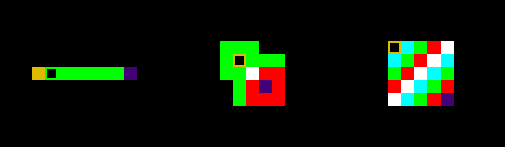

# Notes

Author: Colin Gay

Design: Notes is a minimalist puzzle game based on the pitch of your sound. Find a way to reach the end with the correct pitch.

Screen Shot:

How To Play:

WASD to move, R to reset.

NOTE: the first level should be a tutorial level, but is not programmed to be so; as a result, it is possible to fail. The player is highly encouraged to press only the D key.

Sources:

All assets are generated using OpenGL and C++ sorcery. Sounds adapted from Jim McCann's menu clinks and clonks.

This game was built with [NEST](NEST.md).
